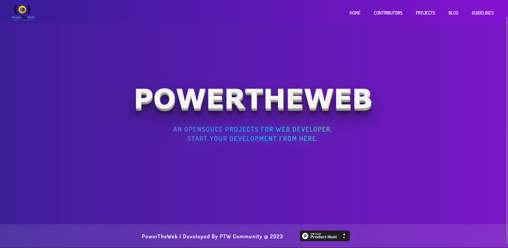

# Open-source Project💯✅



PowerTheWeb is an open-source project to help web developers make their road easy to become a successful web developer
<div align="center">
<a href="https://www.producthunt.com/posts/powertheweb?utm_source=badge-featured&utm_medium=badge&utm_souce=badge-powertheweb" target="_blank"></a>
</div>


## Don't Forget to JOIN OUR COMMUNITY
Join our community and ask anything. If you run into a problem please let us know.
DISCORD - [JOIN](https://discord.gg/6XRTeHRxWV)

## STAR THE REPO
### How to Contribute to this repository

1. Fork the repository first (Click the Fork button in the top right of this page,
   click your Profile Image)
2. Clone the forked repository to your local machine.

```markdown
git clone https://github.com/your-username/devvsakib/power-the-web.git
```

3. change the present working directory

```markdown
cd power-the-web
```
4. Open CMD in your current directory and install npm packages using command.
```markdown
npm install
```
5. Run the project.
```markdown
npm run dev
```

5. Make changes in the project. Add, Commit and Push the project using following commands:

> Create a Branch
```markdown
git checkout -b <name of the branch>
```
- Make the changes

> Add all files 
```markdown
git add . 
```
> Commit the changes
```markdown
git commit -m "Write Your commit Message" 
```
> Push the branch
```markdown
git push 
```
OR
```markdown
git push origin branch-name
```
> Make Pull Request from Github Repository
** Star the repository. **

### Adding Projects
If you want to add your project in repository, you are welcome. Please add your project in "PROJECTS" folder and make sure to name your folder as your project.
<br>
Ex:
<br>
we have a react projects in "PROJECTS" folder
<br>
and we named it "clone-tesla"
<br><br>
So, people will know what project it is. Make sure you added your github name and link as comment in your file. Last thing to do is, put your name. github link, email in CONTRIBUTORS.md file

### NOTE

- Make Sure you commit your changes in a new branch.
- Make Sure you Give proper name to your files describing the addition.
- Also Make Sure you comment your code wherever necessary.


## REPO STATUS


> Size: 130.00 MiB
<br>

## Event Occured
1. Hacktoberfest 2022 ✅
2. Diversion 2023 ✅
<br>

<br>
<!--
<div align="center">
    
    <p><b><a href="https://github.com/devvsakib">DevvSakib</a></b><br> Maintainer</p>
</div>
-->

## Thanks to all the contributors ❤️
Add your details in contributions.json file


<a href = "https://github.com/devvsakib/hacktoberfest-react-project/graphs/contributors">
  
</a>
<div align="center">
Show some ❤️ by starring this awesome repository!
</div>
